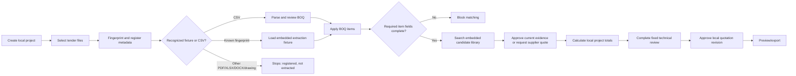

# AI Pricing Agent — Current Product Audit

**Audit date:** 1 August 2026  
**Scope:** Current local product only  
**Method:** Static code and architecture inspection, workflow tracing, review of the current automated checks, and reconciliation of visible product behavior with the implemented data paths.  
**Constraint:** This is an audit, not a redesign. No product code was changed.

## 1. Executive conclusion

### Overall maturity: Functional Prototype

The product is beyond a visual concept. It has a coherent construction-estimation workflow, real browser-side state transitions, pricing guardrails, technical-review gates, supplier comparison logic, quotation approval controls, and a useful generic CSV BOQ path. However, it is not yet an MVP that can safely process real tender packages end to end.

The decisive limitation is not the interface. It is the execution boundary behind the interface:

- Uploaded files are handled in the browser and their original bytes are not durably stored.
- Most PDFs, Excel workbooks, Word files, drawings, catalogues, and quotations are registered but not extracted.
- The new native XLSX parser, PDF-readiness inspector, processing contracts, and database schema are credible foundations, but are disconnected from the running application.
- There is no upload API, object storage, durable job queue, background processing worker, OCR service, authoritative database workflow, or matching index.
- Product matching is based on a small embedded catalogue and description substring checks, not a general AI or engineering matching engine.
- Identity and authorization are simulated through local UI state; they are not enforced by a trusted server.

Consequently, the current product demonstrates the intended operating model well, but cannot yet reliably ingest and price an arbitrary construction tender.

## 2. Architecture reality

| Layer | Current implementation | Status | Consequence |
|---|---|---|---|
| User interface | Large React client in `app/page.tsx` (2,946 lines) | Implemented | Valuable prototype, but tightly coupled and difficult to test or evolve safely |
| Project state | React state persisted to browser `localStorage` | Implemented locally | Survives refresh on one browser; no shared, authoritative or multi-user state |
| File intake | Browser `File` reading, SHA-256 fingerprinting, metadata registration | Partially implemented | Duplicate/revision logic works locally, but source files are not durably retained |
| CSV parsing | Generic BOQ CSV parser with validation and review | Implemented | The only general extraction route currently connected to the UI |
| XLSX parsing | Native OpenXML parser with cell provenance | Implemented but disconnected | Cannot yet process an uploaded workbook in the running product |
| PDF triage | PDF readiness inspector | Implemented but disconnected | No general PDF text, table, clause or drawing extraction |
| Processing contracts | Stage model, classification, retry/cancel, result envelopes and publication gate | Implemented but disconnected | Good design contracts with no operational job runner |
| Database | Drizzle/D1 schema and migration for document intelligence | Implemented but disconnected | Application continues to use browser state; records are not authoritative |
| Object storage | None | Missing | Original tender evidence cannot be retrieved or audited reliably |
| Queue/background worker | None | Missing | No resilient processing, retry, concurrency control or long-running extraction |
| API/service layer | No document-processing or workflow APIs | Missing | Business rules and mutations remain inside the client |
| Authentication/authorization | Auth helper exists; UI role selection is local | Simulated/disconnected | Users and permissions are not trustworthy security controls |
| AI/OCR/semantic retrieval | None operational | Missing | No general intelligent extraction or semantic matching |
| Deployment worker | Framework/image handling only | Implemented for hosting | Does not provide application services |

## 3. Feature and module audit

Status definitions used below: **Working**, **Partially Working**, **Hard-Coded**, **Simulated**, **Disconnected**, **Not Implemented**.

| Module / feature | Status | Evidence and principal problem | Business / technical impact | Priority and next step |
|---|---|---|---|---|
| Home portfolio dashboard | Working locally | Aggregates saved local projects and separates portfolio from project workspace | Useful orientation, but only represents this browser | P2 — reconnect to authoritative project queries after backend exists |
| Project creation/editing/archive | Working locally | Real local records and transitions | Cannot support team ownership, recovery or shared projects | P1 — persist through authenticated project service |
| Project dashboard | Working locally | Project-specific BOQ, evidence, review and readiness state | Correct conceptual separation; metrics inherit incomplete extraction | P2 — source metrics from server workflow state |
| File selection and fingerprinting | Partially Working | Reads file bytes, computes SHA-256 and registers metadata | Useful duplicate control, but upload is not durable | P0 — add upload session, object storage and immutable document version |
| Duplicate/revision handling | Partially Working | Same-name and known-fingerprint behavior exists locally | Revision history can disappear with browser state | P0 — enforce version lineage and uniqueness server-side |
| Original-file storage | Not Implemented | File bytes are excluded from persisted project backup | Evidence, reprocessing and audit cannot be guaranteed | P0 — object storage with checksum, tenant and retention metadata |
| Known BOQ workbook extraction | Hard-Coded | Exact known fingerprint loads embedded 90-row/21-candidate fixture | Excellent demo path but does not prove workbook extraction | P0 — replace fixture route with connected XLSX job |
| Generic CSV BOQ extraction | Working | General parser validates required columns and sends rows to review | Useful narrow production seed; lacks durable source/result records | P1 — run server-side and persist provenance/errors |
| General XLSX extraction | Disconnected | Native parser exists but upload handler does not call it | Real BOQs and price lists appear uploaded without producing data | P0 — connect parser to document jobs and review staging |
| General PDF extraction | Not Implemented | Readiness inspection exists only as a disconnected helper | Specifications and quotations do not become structured evidence | P0 — text/layout parser, page provenance and selective OCR |
| OCR | Not Implemented | No OCR provider, orchestration or confidence handling | Scanned documents cannot be processed | P0 — selective page OCR after text-density/readiness assessment |
| Word extraction | Not Implemented | No DOCX parser or mapping path | Tender narratives and scope files are ignored | P1 — add DOCX paragraph/table extractor with provenance |
| Specification extraction | Hard-Coded | One known fire-alarm specification loads six embedded clauses | Review experience works only for prepared fixture | P0 — generalized clause/requirement extraction into review staging |
| Drawing intelligence | Not Implemented | Drawing filenames can be indexed, but symbols, quantities, zones and circuits are not interpreted | No drawing-derived takeoff or cross-checking | P1 — first provide page/sheet classification; defer automated takeoff until measurable |
| Catalogue/price-list ingestion | Hard-Coded | Known Honeywell fingerprint exposes embedded candidate library | Cannot ingest an arbitrary supplier catalogue | P0 — map connected XLSX output to normalized product records |
| BOQ readiness guard | Working | Requires system, item, unit, quantity and specification before matching | Correctly prevents generic high-confidence approvals | P1 — move rule to authoritative domain service and retain UI explanation |
| Product matching | Partially Working / Hard-Coded | Embedded six-item library plus description substring applicability | Cannot establish general exact/compatible/alternative matches | P0 — normalized attributes and exact-model retrieval before semantic ranking |
| Match confidence/explanation | Partially Working | UI distinguishes matching readiness and source evidence | Confidence is not derived from a general feature model | P1 — persist match features, exclusions and score version |
| Historical price discovery | Working as a guardrail | Expired evidence remains discovery-only and cannot be approved | Correct risk control | P1 — retain while migrating evidence checks server-side |
| Manual price approval | Working locally | Requires source document role, validity and reason | Strong prototype control; locally bypassable and not durable | P1 — enforce through authorization and immutable approval events |
| Cost calculations | Working | Quantity, unit cost, markup, selling price, VAT, risk and selected freight logic calculate from current records | Core arithmetic is useful and testable, but lives in client state | P1 — extract versioned pricing engine and golden calculation tests |
| Installed-cost build-up | Partially Working | Materials calculations exist; broad labor/productivity/engineering/testing model does not | Quotations may omit major construction delivery costs | P1 — introduce explicit cost components only after evidence model is defined |
| Discount assumptions | Working as a guardrail | Unsupported blanket discount is rejected | Prevents a material commercial error | Retain and enforce centrally |
| Supplier RFQ creation/grouping | Working locally | Creates and groups scope; CSV export available | No actual supplier transmission or communication record | P2 — keep as draft/export until outbound integration is intentionally added |
| RFQ sending | Simulated / Not Implemented | Product describes readiness; it does not send email or portal RFQs | Users may mistake draft state for communication | P1 — label clearly; later add audited outbound service |
| Supplier response and bid leveling | Working locally | Manual offer normalization, comparison, award and evidence application | Useful workflow; source evidence and approval are not server-authoritative | P1 — persist offers, currencies, validity, exclusions and awards |
| Technical review | Working for fixed fixture | Six fixed requirements have decisions, notes, evidence and deviation blocks | Strong interaction model, not generalized across documents or disciplines | P1 — generate requirements from extraction results and version decisions |
| Quotation revision approval | Working locally | Calculation fingerprint and approval gate are tied together | Protects against silent local changes, but is not a server signature | P1 — immutable revision, approval identity and server timestamp |
| Tender-ready proposal output | Partially Working | Preview/export-oriented output exists; no full governed proposal package | Not yet sufficient for formal submission | P2 — implement after source, pricing and approvals become authoritative |
| Audit trail | Partially Working | Local event history/checksum behavior exists | Browser owner can alter or lose it; no trusted time or identity | P0 — append-only server events with actor, reason, correlation and version |
| Backup/restore | Working locally | Checksummed project data can be exported/restored | Does not include original file bytes; not disaster recovery | P2 — retain as convenience, not system backup |
| Database schema | Disconnected | Document intelligence tables and migration exist | Creates false sense of durability while UI never uses them | P0 — introduce repositories/services and make DB authoritative incrementally |
| Automated tests | Partially Working | Broad pure-logic/source guardrails and render smoke coverage; current suite has 232 passing checks | Limited browser E2E, API, persistence, security, parser-fixture and failure recovery proof | P1 — test connected paths rather than source-presence alone |
| Type safety | Partially Working | Normal build/lint succeed, but full TypeScript checking has pre-existing failures | Refactors can introduce hidden runtime defects such as earlier undefined `.trim`/`.filter` failures | P0 — establish a passing full type-check gate |

## 4. Detailed workflow audit

### 4.1 Home and project control

- **User action:** Create, open, copy scope, edit or archive a project.
- **Code executed:** Client handlers in the main page component mutate a `LocalProject` graph.
- **Storage:** Browser `localStorage`.
- **Persistence:** Yes on the same browser/profile; no durable shared persistence.
- **Downstream:** Opening a project drives documents, BOQ, sourcing, review and quotation views.
- **Failure behavior:** Legacy/default guards reduce crashes, but malformed or incompatible local state remains a risk.
- **Tests:** Logic and rendered-output guardrails exist; no multi-user or server transaction tests are possible yet.

### 4.2 Document intake

- **User action:** Drop or select one or more tender files and assign a role when needed.
- **Code executed:** `handleFiles` reads bytes, fingerprints files, checks known fixtures, detects duplicates/revisions and registers metadata.
- **Storage:** Metadata and derived local records only; original bytes are not retained in durable storage.
- **Persistence:** Local project state persists; the processing input itself does not.
- **Downstream:** CSV and three exact known fingerprints can create meaningful review data. Other files generally stop at registration.
- **Failure behavior:** Unsupported/unrecognized content can look accepted even though no extraction occurred.
- **Tests:** Known-file and parser guardrails exist; no upload API, interruption, large-file, malware, tenancy or object-recovery tests.

### 4.3 BOQ review

- **User action:** Review extracted candidates, resolve validation issues and apply accepted items.
- **Code executed:** Known-fixture transformation or generic CSV parser, followed by staging/review/application handlers.
- **Storage:** Local extraction state and accepted BOQ items.
- **Downstream:** Applied items become eligible for matching, pricing and quotation calculations.
- **Failure behavior:** CSV errors are surfaced; arbitrary XLSX files do not reach this path.
- **Tests:** Strongest general extraction test coverage currently belongs to CSV.

### 4.4 Matching and price evidence

- **User action:** Request matches for a sufficiently specified BOQ item, then select or manually enter evidence.
- **Code executed:** `matchReadiness`, embedded candidate filtering, validity/currency/source rules and cost-state updates.
- **Storage:** Local item/evidence records.
- **Downstream:** Accepted current evidence contributes to cost and selling totals.
- **Failure behavior:** Missing specification blocks matching; expired historical evidence is discovery-only. Unknown products usually have no general retrieval path.
- **Tests:** Guardrail tests are useful, but there is no retrieval-quality evaluation set, compatibility benchmark or model/version tracking.

### 4.5 Sourcing and supplier award

- **User action:** Create grouped RFQs, export scope, manually enter offers, compare and award.
- **Code executed:** Local grouping, normalization, bid leveling and award handlers.
- **Storage:** Local project state.
- **Downstream:** Awarded evidence may update BOQ costs when current and valid.
- **Failure behavior:** No actual transmission, mailbox ingestion or durable supplier record. Currency conversion depends on supplied rate evidence.
- **Tests:** Domain guardrails exist; no integration or concurrency tests.

### 4.6 Technical review and quotation

- **User action:** Decide requirements, document deviations, review totals, approve a calculated revision and issue/export.
- **Code executed:** Fixed requirement decision model, readiness gates, calculation fingerprint and quotation handlers.
- **Storage:** Local project state and local audit events.
- **Downstream:** Approval unlocks final issue only when the represented conditions pass.
- **Failure behavior:** Unextracted requirements never enter review; local roles/audit can be altered by the browser owner.
- **Tests:** Useful calculation and guardrail checks; no authenticated approval, immutable revision or full tender-package E2E test.

## 5. Extraction pipeline audit

| Input | Parser actually called by live UI | Structured output | Accuracy / failure visibility | Persisted? | Downstream use |
|---|---|---|---|---|---|
| Generic BOQ CSV | Yes | Candidate BOQ rows with validation | Explicit review/errors | Derived state only | BOQ, matching, pricing |
| Exact known BOQ XLSX | Embedded fingerprint fixture | Prepared BOQ candidates | Deterministic demo, not general accuracy | Derived state only | BOQ, matching, pricing |
| Arbitrary XLSX | No | None | May be registered without extraction | No source bytes | None |
| Exact known Honeywell price list | Embedded fingerprint fixture | Prepared product candidates | Deterministic demo | Derived state only | Matching/pricing discovery |
| Arbitrary catalogue/quote XLSX | No | None | No mapping/review | No | None |
| Exact known specification PDF | Embedded fingerprint fixture | Six prepared requirements | Deterministic demo | Derived state only | Technical review |
| Arbitrary text PDF | No general parser | None | Registration can be mistaken for processing | No | None |
| Scanned PDF | No OCR | None | No extraction confidence or page exceptions | No | None |
| Drawings | No drawing parser | Filename/index metadata | No symbol/count/zone validation | No | None |
| DOCX | No parser | None | No processing path | No | None |

The unconnected native XLSX parser and PDF readiness inspector should not be counted as product capability until the upload/job path invokes them, stores their outputs and exposes failures for review.

## 6. Matching audit

| Matching behavior | Current state |
|---|---|
| Exact normalized manufacturer/model matching | Not generalized |
| Technical attribute compatibility | Not implemented |
| Approved-equal/alternative management | Not implemented as a general catalogue function |
| Semantic retrieval | Not implemented |
| Historical project retrieval | Embedded discovery examples only |
| Supplier catalogue retrieval | Embedded six-candidate library only |
| Evidence validity enforcement | Working locally |
| Low-information protection | Working: required BOQ fields gate matching |
| Explainability | Partial: source/readiness shown; no persisted match-feature breakdown |
| Human approval | Working locally, not authoritative |

The corrected readiness gate resolves the earlier critical problem where an unspecified “New BOQ item” could receive approvable, high-confidence prices. The remaining issue is breadth: safe behavior exists, but general matching capability does not.

## 7. Pricing audit

### Correctly implemented

- Quantity × approved current unit cost.
- Markup and selling-price calculation.
- VAT presentation.
- Risk allowance behavior represented in project calculations.
- Selected freight allocation from accepted supplier evidence.
- Controlled currency conversion when a rate/evidence is present.
- Blocking expired historical prices from direct approval.
- Rejecting unsupported blanket discount assumptions.
- Revision fingerprinting to detect calculation changes after approval.

### Incomplete or absent

- General manufacturer discount structures and validity periods.
- Labor productivity and crew build-ups.
- Installation, engineering, programming, testing and commissioning models.
- Equipment, consumables, access, logistics and project-overhead allocation.
- Escalation and lead-time risk models.
- Versioned server-side calculation service and reproducible calculation snapshot.
- Organization-level pricing policy and approval thresholds.

Business consequence: the current totals can be internally consistent while still representing a materials-led subset rather than the complete delivered construction cost.

## 8. Review and approval audit

| Control | Current result |
|---|---|
| Analyst can see staged BOQ candidates before applying | Yes for CSV/known BOQ |
| Source provenance reaches page/cell/clause level | Partial; strongest in disconnected parsers and fixed fixtures |
| Technical requirements are reviewed explicitly | Yes for six fixed requirements |
| Deviations can block progression | Yes locally |
| Price evidence validity is checked | Yes locally |
| Supplier award is explicit | Yes locally |
| Quotation approval is tied to calculation revision | Yes locally |
| Real authenticated approver | No |
| Server-enforced role segregation | No |
| Immutable approval/audit record | No |
| Reprocessing preserves authoritative source/result lineage | No |

## 9. Dashboard and metric audit

| Metric | Source | Assessment |
|---|---|---|
| Project count/status | Local saved projects | Real for this browser only |
| Document count | Base/registered document metadata | Can overstate processed documents |
| BOQ count | Applied local BOQ items | Real for accepted items |
| Pricing coverage | Items with qualifying current evidence | Useful and project-specific |
| Cost/selling totals | Approved local evidence and calculations | Mathematically meaningful within represented scope |
| Technical readiness | Fixed requirements and local decisions | Meaningful for fixture, not arbitrary specifications |
| Project health/control state | Client-derived rules | Useful workflow signal, not authoritative portfolio governance |

The most important correction is semantic: **registered**, **classified**, **extracted**, **reviewed**, and **published** must never be presented as equivalent document states.

## 10. Actual end-to-end workflow today

The primary operational break is at `X`: normal construction files do not enter a real extraction pipeline. A second boundary is after `J`: matching is not general beyond the embedded catalogue and manual evidence.

## 11. Fake, placeholder, simulated or misleading elements

1. Exact fingerprints that load prepared BOQ, specification and catalogue data are demo fixtures, not extraction engines.
2. The embedded Honeywell candidate library and historical sources are sample datasets, not a searchable supplier knowledge base.
3. “Indexed” drawing/document presentation does not mean drawing content was understood.
4. Local role switching is a workflow demonstration, not authentication or authorization.
5. Local audit events/checksums are not an immutable audit trail.
6. RFQs are prepared/exported; they are not sent to suppliers.
7. Database tables exist but are not used by the live workflow.
8. Processing-stage contracts exist but no queue or worker executes them.
9. Native XLSX/PDF-readiness helpers exist but uploaded files do not invoke them.
10. File registration can be visually interpreted as successful processing even when no extraction result exists.

## 12. Critical defects and gaps

### P0 — Blocks a trustworthy MVP

1. **No durable source-file system.** Reproduction: upload a file, export/inspect persisted project data, and observe that original bytes are absent. Impact: no reliable reprocessing, evidentiary audit or recovery. Fix: immutable object storage plus server document/version records.
2. **General files do not extract.** Reproduction: upload an arbitrary XLSX or PDF not matching a known fingerprint. It registers but produces no structured review result. Impact: the principal product promise fails for real tenders. Fix: operational job pipeline invoking parsers and storing versioned results/errors.
3. **Disconnected foundations.** Reproduction: trace imports from `app/page.tsx` and the deployment worker; the new XLSX/PDF/processing/DB modules are not called. Impact: implemented capability is invisible and unverified end to end. Fix: service boundary and one vertical connected path.
4. **No authoritative identity or authorization.** Reproduction: change the local role selector/context. Impact: approvals and audit attribution cannot be trusted. Fix: authenticated server session and authorization on every mutation.
5. **No authoritative persistence or immutable workflow.** Reproduction: clear/alter browser storage. Impact: projects, approvals and evidence can be lost or changed. Fix: transactional database services and append-only audit events.
6. **Full type-check gate is not clean.** Evidence: full TypeScript checking reports existing errors even though normal build/lint pass. Impact: runtime regressions can escape, as seen in earlier undefined property crashes. Fix: resolve types and make type-check mandatory in CI.

### P1 — Materially limits estimating usefulness

7. Matching is an embedded substring-based demonstration, not a general engineering match engine.
8. Specification review is limited to six prepared fire-alarm requirements.
9. Pricing does not yet represent full installed/delivered construction cost.
10. Document status language can overstate what has been processed.
11. No selective OCR or page-level failure/review workflow.
12. Test coverage emphasizes pure/source guardrails over connected browser/API/persistence/failure scenarios.

### P2 — Important after the core path is reliable

13. Main client component is excessively large and couples UI, domain rules, persistence and fixtures.
14. Formal proposal/report output is not yet a complete governed tender submission.
15. RFQ communication and response ingestion remain manual/export-only.
16. Portfolio reporting is browser-local rather than organization-wide.

## 13. Components worth preserving

- Clear separation between portfolio home and project workspace.
- Project readiness/control-state concept.
- BOQ extraction review before publication.
- Generic CSV parser and its validation rules.
- Low-information matching block and evidence validity rules.
- Separation of discovery-only historical prices from approvable current evidence.
- Supplier bid-leveling and explicit award flow.
- Technical deviations as workflow blockers.
- Calculation fingerprint tied to quotation approval.
- Native XLSX provenance design.
- Document-processing stage contracts, retry/cancel semantics and publication gate.
- New document intelligence relational schema as a starting model.
- Local backup/restore as a convenience feature after server persistence exists.

These elements encode useful construction-estimation judgment. They should be moved behind clear interfaces, not discarded.

## 14. Technical debt summary

- A 2,946-line client component owns presentation, domain logic, workflow, persistence and demo data.
- Browser state is treated as the system of record.
- Duplicate domain representations and legacy-state compatibility increase undefined-field risk.
- Demo fixtures and operational paths are interleaved.
- Server/service/repository boundaries are absent.
- Parsing modules are not integrated with storage, jobs, review or downstream publication.
- No object-storage lifecycle, tenant isolation, retention or malware controls.
- No queue idempotency, leases, dead-letter handling, observability or reprocessing console.
- No authoritative calculation/version/audit service.
- No general evaluation corpus for extraction and matching quality.
- Full TypeScript compilation is not a release gate.
- No browser E2E, persistence integration, concurrency, security or performance test suite of production relevance.

## 15. Immediate execution order

This sequence is intentionally narrow and dependency-driven; it is not a broad feature roadmap.

1. **Make the build trustworthy:** clear full TypeScript errors and add type-check to the release gate.
2. **Establish trusted identity:** authenticated session, organization/project membership and server-enforced permissions.
3. **Implement immutable intake:** upload API, object storage, checksum, document version and explicit lifecycle states.
4. **Make persistence authoritative:** connect the existing schema through repositories/services; retain local state only as cache/draft where appropriate.
5. **Add durable processing orchestration:** job queue, idempotency, retry, cancellation, failure reason, progress and audit events.
6. **Connect one complete vertical path:** XLSX/CSV BOQ upload → stored source → job → parser → staged rows with provenance → human review → published BOQ.
7. **Add PDF text/layout extraction and selective OCR:** page-level outputs, confidence, exceptions and reprocessing.
8. **Add structured specification, quotation and catalogue mappings:** each with review staging and provenance before publication.
9. **Publish a normalized matching index:** exact manufacturer/model first, then technical compatibility, then explainable semantic candidates; preserve human approval.
10. **Move pricing and approvals server-side:** versioned calculations, complete cost components, approval policies and immutable quotation revisions.
11. **Prove the whole workflow:** real fire-alarm tender fixture set, browser E2E, parser accuracy benchmarks, failure recovery, security/tenancy and performance tests.

The first product milestone should be one fully connected and auditable BOQ ingestion path, not additional screens. Once that path is sound, the same processing framework can safely expand to specifications, quotations, catalogues and drawings.

## 16. Definition-of-done assessment

| Required outcome | Result |
|---|---|
| Honest current-state classification | Met |
| Actual code paths distinguished from visual claims | Met |
| Working, partial, hard-coded, simulated, disconnected and missing behavior identified | Met |
| Extraction, matching, pricing, review, dashboard and workflow inspected | Met |
| Critical defects and business impact prioritized | Met |
| Reusable assets and technical debt identified | Met |
| Immediate dependency-ordered execution plan provided | Met |
| Production readiness demonstrated | **Not met by the product** |

### Final judgment

The local application is a **credible, domain-informed functional prototype**. Its strongest value is the workflow and risk-control thinking already encoded in the interface. Its weakest point is that the system currently demonstrates processing more often than it performs processing. The next phase should turn the existing document-intelligence contracts and parser foundations into one durable, end-to-end, evidence-preserving execution path before expanding the product surface.

## 17. Evidence limitations

This audit can verify the local codebase and locally represented workflows. It cannot establish production multi-user behavior, hosted data durability, real supplier communications, extraction accuracy across a representative tender corpus, security posture under attack, or production-scale performance because those operational systems and evaluation datasets do not yet exist in the inspected implementation.
