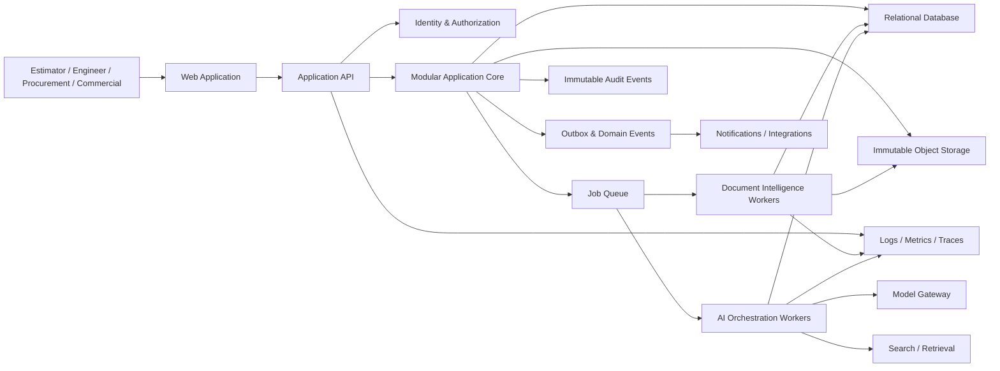
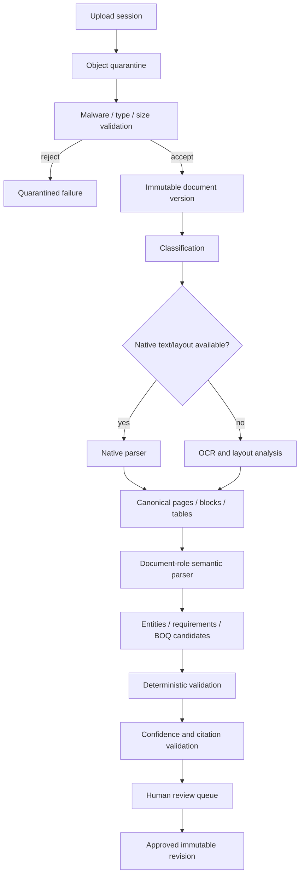
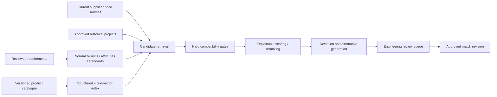

# AI Pricing Agent — System Architecture Baseline

Status: Proposed target architecture based on verified local implementation  
Date: 1 August 2026  
Architecture horizon: Three releases  
Product: Enterprise AI pre-sales engineering platform

## 1. Architecture decision summary

AI Pricing Agent should evolve from its current browser-local prototype into a tenant-aware modular monolith with asynchronous document-intelligence workers. It should not begin as a network of microservices.

The existing prototype has strong domain safeguards worth preserving, but it has no durable application backend: the relational schema is empty, hosting persistence bindings are unset, original documents are not retained, authentication helpers are unused, and almost all workflow/data/calculation logic lives in one client component. The first architecture goal is therefore to make one authoritative server application, not distribute immature boundaries across many services.

Recommended initial platform:

- Web application and API: TypeScript application deployed through the existing Cloudflare Worker/Vinext runtime
- Transactional storage: relational SQL through Drizzle; D1 is acceptable for the controlled pilot, behind repository interfaces
- Object storage: immutable document and generated-output objects; R2 is the natural initial adapter
- Background processing: durable queue with idempotent consumers and dead-letter handling
- Search: relational metadata/filtering first; separate full-text/vector adapters only for validated retrieval use cases
- AI: provider-neutral model gateway with schema validation, prompt/model versions, provenance, evaluation, and cost controls
- Observability: structured logs, traces, metrics, job/model quality telemetry, and immutable application audit events

## 2. Verified current architecture

### Runtime

- Next/React 19 application built with Vinext/Vite and deployed through a Cloudflare Worker entry point.
- One primary client page of approximately 2,950 lines.
- More than 100 local state hooks coordinate application, workflow, modals, drafts, documents, RFQs, costing, approvals, and reports.
- A small generic CSV BOQ parser and recently extracted pure domain modules exist.

### Persistence

- Current product data is serialized to browser `localStorage`.
- Local JSON backup/restore is checksummed but does not contain original source files.
- Drizzle configuration exists, but `db/schema.ts` is empty.
- `.openai/hosting.json` has no D1 or R2 binding configured.

### APIs and services

- No product REST/GraphQL API exists.
- Worker routes only the application and image optimization.
- No queue, scheduler, webhook, integration, search, or AI service exists.

### AI and document workflow

- Known BOQ/specification/catalogue files are recognized by exact fingerprints.
- Generic CSV BOQ rows can be staged and reviewed.
- Fire-alarm requirements and catalogue candidates are embedded fixtures.
- Matching safeguards are credible, but retrieval and reasoning are not generalized AI services.

### Security and operations

- Authentication helper functions exist but are not called by the product page.
- Working roles are local responsibility context, not authenticated authorization.
- Audit chaining is browser-local and explicitly not cryptographic/nonrepudiable.
- There is no application logging, monitoring, secret-management design, data retention, or disaster recovery.

## 3. Preserve, improve, refactor, remove

### Preserve

- Eight-stage governed workflow and evidence-based readiness
- Strict separation of discovery candidates from approvable price evidence
- Source validity and expiry controls
- Project ownership checks for RFQs and approvals
- Requirement evidence and deviation review
- Scope-conflict and materials-only authorization control
- Revision-bound quotation fingerprints
- Human approval before client issue
- Project-isolated activity and export concepts

### Improve

- Home versus Project dashboard separation
- Progressive disclosure and owner-routed action queues
- Document revision controls and evidence maps
- Supplier bid comparison and commercial settings
- Responsive/accessibility coverage
- Behavioral tests and production release gates

### Refactor

- Move domain rules from React into pure domain modules
- Move commands, authorization, transactions, and audit creation to the server
- Replace localStorage snapshots with repositories and versioned entities
- Split UI into route/module components backed by query/command contracts
- Replace embedded fixtures with explicit sample-project seeds
- Replace UI-derived readiness with one workflow policy service

### Remove

- Any claim that browser-local roles provide separation of duties
- Fingerprint-specific extraction as a production mechanism
- Default demo evidence in real project creation
- Direct client mutation of approved commercial state
- Duplicate readiness calculations across screens
- Product code paths that treat file names as authoritative classification

## 4. Target logical architecture



## 5. Deployment architecture

### Initial production topology

1. Web/API Worker
   - Server rendering and application API
   - Authentication session resolution
   - Authorization enforcement
   - Synchronous commands and queries
   - Signed upload/download URLs
   - No heavy OCR/model processing

2. Relational database
   - Transactional source of truth
   - Tenant-scoped rows and constraints
   - Workflow, decisions, revisions, and audit metadata
   - Outbox table written in the same transaction as domain changes

3. Object storage
   - Original immutable source versions
   - OCR/layout artifacts
   - generated quotation packages
   - malware/quarantine state
   - content-addressed checksum metadata

4. Queue consumers
   - file classification and extraction
   - OCR/layout/table parsing
   - AI requirement extraction and matching
   - report/quotation generation
   - notifications/integrations

5. Search adapters
   - SQL filtering for projects, documents, products, and prices
   - full-text index for document/product text when SQL search is insufficient
   - vector index only for evaluated semantic retrieval tasks

### Scaling path

- Scale queue consumers by job type and backlog age.
- Partition large catalogue ingestion from latency-sensitive project work.
- Add read replicas/analytics store only after measured query contention.
- Split a module into a service only when it has distinct scale, security, availability, data ownership, or team ownership needs.
- Never share database tables across independently deployed services after a split; use APIs/events and explicit ownership.

## 6. Modular application boundaries

| Module | Owns | Does not own |
|---|---|---|
| Identity & Access | organizations, users, memberships, roles, permissions, sessions | project workflow rules |
| Project Management | projects, locations, disciplines, stakeholders, tender dates, project settings | document content, quotations |
| Document Management | immutable files, versions, issue metadata, classifications, access | extracted engineering assertions |
| Document Intelligence | processing jobs, pages, blocks, tables, extraction runs, citations | approval decisions |
| Engineering Analysis | technical requirements, standards, relationships, compliance reviews | prices and supplier awards |
| Product Intelligence | manufacturers, products, attributes, compatibility, lifecycle, catalogue versions | project-specific commercial approval |
| Matching | match runs, candidates, score components, explanations, deviations | final engineering decision |
| Pricing & Cost | price sources, currencies, landed costs, assemblies, scenarios, margins | supplier communication |
| Supplier Sourcing | suppliers, contacts, RFQs, communications, responses, offers, awards | client quotation approval |
| Review & Workflow | review tasks, assignments, policies, stage readiness, decisions | source extraction/model execution |
| Quotation | commercial revisions, terms, qualifications, templates, issued packages | internal supplier communication |
| Reporting | read models and governed analytics | transactional truth |
| Audit & Compliance | append-only application events, access records, integrity metadata | operational debug logs |
| Notifications | preferences, templates, delivery attempts | workflow decisions |
| Administration | organization policies, catalogues, templates, retention, integrations | bypassing domain permissions |

These begin as modules in one deployable application. Each module exposes typed commands, queries, events, and repository interfaces.

## 7. Software architecture

```text
app/
  routes/                 HTTP/UI adapters
  components/             presentation only
  modules/
    projects/
      domain/             entities, values, policies
      application/        commands, queries, ports
      infrastructure/     SQL/object/API adapters
    documents/
    engineering/
    products/
    matching/
    pricing/
    sourcing/
    workflow/
    quotations/
    audit/
  platform/
    auth/
    database/
    object-storage/
    queue/
    ai-gateway/
    observability/
  workers/
    document-processing/
    ai-processing/
    notifications/
```

Rules:

- Domain modules do not import React, HTTP, SQL, Cloudflare, or model SDKs.
- Application commands own transactions and emit domain events.
- UI never writes repositories directly.
- Infrastructure adapters implement ports defined by application modules.
- Cross-module writes happen through commands, not shared mutable objects.
- Read models may denormalize for portfolio/reporting performance.

## 8. Database architecture

### Tenant and identity

- `organizations`
- `users`
- `organization_memberships`
- `roles`
- `permissions`
- `role_permissions`
- `project_memberships`

Every tenant-owned table includes `organization_id`. Authorization queries require organization and project scope. Database indexes and composite unique constraints include tenant ownership where appropriate.

### Project and document core

- `projects`
- `project_locations`
- `project_disciplines`
- `project_stakeholders`
- `project_settings_revisions`
- `documents`
- `document_versions`
- `document_issues`
- `document_processing_runs`
- `document_pages`
- `document_blocks`
- `document_tables`
- `source_citations`

`documents` represent logical documents; `document_versions` are immutable uploaded content. Issue metadata is distinct from file version because construction revision and binary content are related but not identical concepts.

### Engineering and BOQ

- `boq_revisions`
- `boq_items`
- `boq_item_source_links`
- `technical_requirement_sets`
- `technical_requirements`
- `requirement_relationships`
- `requirement_source_links`
- `technical_review_decisions`
- `standards_references`

BOQ and requirement revisions are immutable after approval. Corrections create new candidate/revision records rather than overwriting reviewed history.

### Products and matching

- `manufacturers`
- `product_catalogues`
- `catalogue_versions`
- `products`
- `product_identifiers`
- `product_attributes`
- `product_documents`
- `compatibility_rules`
- `product_lifecycle_events`
- `match_runs`
- `match_candidates`
- `match_score_components`
- `match_explanations`
- `match_review_decisions`

Frequently queried core attributes may use typed columns; long-tail discipline/manufacturer attributes may use validated JSON with schema/version references. Do not put all engineering data into a generic key-value model.

### Pricing, sourcing, and quotation

- `price_sources`
- `price_source_versions`
- `price_entries`
- `exchange_rate_evidence`
- `cost_books`
- `cost_book_versions`
- `assemblies`
- `assembly_components`
- `cost_scenarios`
- `cost_lines`
- `suppliers`
- `supplier_contacts`
- `rfqs`
- `rfq_lines`
- `rfq_deliveries`
- `supplier_responses`
- `supplier_response_lines`
- `supplier_awards`
- `quotation_revisions`
- `quotation_lines`
- `quotation_terms`
- `quotation_approvals`
- `issued_documents`

Use fixed-precision decimal storage, explicit currency, source validity, and rounding policy. Never use binary floating-point as the authoritative persisted commercial amount.

### Workflow, events, and audit

- `review_tasks`
- `review_decisions`
- `workflow_instances`
- `workflow_transitions`
- `domain_outbox`
- `audit_events`
- `notification_deliveries`
- `integration_sync_states`

`audit_events` are append-only application records with trusted server timestamps, actor identity, tenant/project ownership, action, reason, affected revision, correlation ID, and integrity metadata. Operational logs remain separate.

## 9. API strategy

### Decision

Use versioned REST/JSON for commands and resource queries. Do not introduce GraphQL initially.

Reasons:

- Workflow commands require explicit authorization, idempotency, and audit semantics.
- REST contracts are simpler for integrations, queues, generated clients, and security review.
- Current product does not have a proven flexible-query requirement that justifies GraphQL complexity.
- Reporting can use purpose-built read endpoints.

GraphQL may be reconsidered for read-heavy configurable analytics after stable domain APIs exist.

### API conventions

- Base path `/api/v1`
- OpenAPI contract generated/validated in CI
- JSON Schema validation at every boundary
- Authentication required except health and controlled inbound webhooks
- Authorization evaluated server-side per organization, project, command, and resource
- `Idempotency-Key` required for uploads, processing starts, RFQ sends, awards, approvals, and issue commands
- Optimistic concurrency through entity revision/ETag
- Cursor pagination for large collections
- Stable error envelope: code, message, field errors, correlation ID, retryability
- Rate limits by user, organization, endpoint class, and AI/document budget
- Correlation/causation IDs propagated through jobs and events

### Representative endpoints

```text
POST   /api/v1/projects
GET    /api/v1/projects?cursor=&status=&owner=&due_before=
GET    /api/v1/projects/{projectId}
POST   /api/v1/projects/{projectId}/documents/upload-sessions
POST   /api/v1/projects/{projectId}/documents/{documentId}/versions/{versionId}/process
GET    /api/v1/processing-runs/{runId}
GET    /api/v1/projects/{projectId}/boq/revisions/{revisionId}/candidates
POST   /api/v1/projects/{projectId}/boq/revisions/{revisionId}/decisions
POST   /api/v1/projects/{projectId}/match-runs
GET    /api/v1/match-runs/{runId}/candidates?cursor=
POST   /api/v1/match-candidates/{candidateId}/review-decisions
POST   /api/v1/projects/{projectId}/rfqs
POST   /api/v1/rfqs/{rfqId}/approve-send
POST   /api/v1/rfqs/{rfqId}/supplier-responses
POST   /api/v1/supplier-responses/{responseId}/award
GET    /api/v1/projects/{projectId}/workflow-readiness
POST   /api/v1/projects/{projectId}/quotation-revisions
POST   /api/v1/quotation-revisions/{revisionId}/approve
POST   /api/v1/quotation-revisions/{revisionId}/issue
GET    /api/v1/projects/{projectId}/audit-events?cursor=
```

### Streaming

- Use server-sent events or polling for processing-job progress; choose SSE only when the user experience requires live updates.
- Do not stream unvalidated model tokens into authoritative engineering fields.
- Model output is accepted only after complete structured-output validation.

## 10. Document intelligence architecture



### File-specific handling

- PDF: native text/layout first, OCR for image pages, page coordinate citations
- Excel: workbook/sheet/cell model, formulas and merged cells, cell/range citations
- Word: paragraphs, tables, headings, tracked revision metadata when available
- Images: OCR/layout and image-region citations
- Email: headers, body, attachments, threading, sender trust classification
- ZIP: bomb/path traversal protection, manifest, recursive limits, isolated child documents
- Drawings: title block, revision, legend, symbols, schedules, zones, scale confidence; no quantity claim without explicit takeoff evidence
- Catalogues/price lists: versioned product/price ingestion with sheet/page provenance and lifecycle dates
- Supplier quotations: supplier/reference/currency/validity/freight/terms/line normalization with discrepancy checks

### Processing guarantees

- Each stage is idempotent using document version plus processor/model/schema version.
- Outputs are immutable processing-run artifacts.
- Retries create attempt records, not duplicate business candidates.
- Partial success is explicit by page/sheet/task.
- Human decisions reference the exact extraction run and source version.

## 11. AI architecture

### Model gateway

All model calls pass through one gateway responsible for:

- provider/model routing
- approved model allowlist
- prompt/template version
- structured-output schema
- tenant/project data policy
- token and cost budgets
- timeout/retry policy
- redaction and logging policy
- correlation IDs
- response storage policy
- evaluation tags

No domain module calls a model provider SDK directly.

### AI task design

| Task | AI responsibility | Deterministic responsibility | Human gate |
|---|---|---|---|
| Classification | rank likely document roles | MIME/signature/filename checks and policy | ambiguous/high-impact roles |
| Entity extraction | propose typed engineering entities | schema, units, ranges, citation validation | low confidence/conflicts |
| Requirement extraction | propose atomic obligations and relationships | page/clause existence, duplicate/conflict checks | engineering acceptance |
| Product matching | retrieve/rank and explain candidates | required attributes, compatibility, lifecycle, price eligibility | product/compliance selection |
| Alternatives | propose comparable options | mandatory requirements and deviation calculation | engineering decision |
| Price normalization | map supplier lines/terms | arithmetic, currency, dates, completeness, reconciliation | procurement award |
| Quotation narrative | draft scope/qualifications | approved-data allowlist and totals | commercial approval |

### Confidence

Confidence must be calibrated by task using labeled evaluation data. It is not a language-model self-rating.

Candidate confidence combines:

- source quality and authority
- citation coverage and locality
- extraction/model agreement
- required-field completeness
- normalized attribute exactness
- compatibility-rule results
- conflict/deviation count
- price source validity
- retrieval/ranking calibration
- historical reviewer outcomes for the same controlled taxonomy

Required fields missing, source citations absent, incompatible attributes, obsolete status unresolved, or current price evidence absent are hard gates regardless of numeric score.

### Explainability object

Each recommendation stores:

- requirement and product revision IDs
- source citations
- matched attributes
- missing attributes
- conflicts/deviations
- compatibility rules evaluated
- retrieval score and reranking components
- price source and validity state
- model/prompt/schema versions
- human review state and reason

### Learning from approved matches

- Approved/rejected decisions become labeled feedback only after quality checks.
- Feedback is tenant-private by default.
- Do not train directly from raw approvals without detecting copied decisions, policy changes, catalogue revisions, and reviewer disagreement.
- Begin with evaluation/ranking features and controlled retrieval boosts, not autonomous online model training.
- Global learning requires explicit governance, anonymization, licensing, and opt-in policy.

## 12. Matching architecture



Keyword/part-number search remains one retrieval signal, not the matching engine. The authoritative match uses structured requirements, attributes, compatible assemblies, standards, lifecycle, datasheets, drawings, supplier evidence, and project policy.

## 13. Events, queues, and background jobs

### Event policy

- Domain events describe completed business facts: `DocumentVersionRegistered`, `ExtractionReviewApproved`, `MatchDecisionRecorded`, `SupplierOfferAwarded`, `QuotationRevisionApproved`, `QuotationIssued`.
- Commands are not events.
- The application writes business state and an outbox row in one database transaction.
- An outbox dispatcher publishes events with tenant/project/correlation/causation IDs.
- Consumers are idempotent and maintain processed-message keys.
- Events contain identifiers and minimal safe metadata, not sensitive document bodies or price tables.

### Job types

- document validation and malware scan
- OCR/layout/table extraction
- semantic extraction by document role
- catalogue ingestion/indexing
- match run and rerank
- quotation/report rendering
- notification and integration delivery
- retention/archive processing

### Job state

`Queued → Running → Succeeded | PartiallySucceeded | Failed | Cancelled`

Each job records attempts, lease/heartbeat, progress, stage, processor version, input/output artifacts, error code, retryability, timestamps, and correlation ID.

Use exponential backoff with jitter for transient errors. Validation failures and unsupported inputs go directly to a non-retryable state. Exhausted jobs enter a dead-letter queue with an operational alert.

## 14. Caching and performance

### Caching

- HTTP/private query caching only for authorization-safe read models
- Cache keys include tenant, project, permission context, entity revision, and query parameters
- Immutable document and catalogue artifacts use content hash/version keys
- AI extraction/matching reuse only when input source versions and every processor/model/prompt/schema version match
- Never cache authorization decisions beyond their safe policy/session lifetime
- Never treat cached price evidence as current without evaluating validity at request time

### Large-data controls

- Multipart/direct object uploads
- Page/sheet-level processing and resumability
- Cursor pagination, server filtering, indexed search
- Virtualized BOQ/catalogue tables
- Batch matching with bounded chunks
- Async exports and report generation
- Query budgets and explain plans for portfolio/report endpoints
- Separate OLTP queries from heavy analytics after measured need

### Initial budgets

- Interactive API P95 under 500 ms excluding external AI/document jobs
- Primary project page usable before long-running job completion
- User-visible processing progress within 2 seconds
- No unbounded list endpoint
- No full document/catalogue payload in browser state

Budgets should be revised from pilot telemetry.

## 15. Security architecture

### Identity and authorization

- Enforce authentication at the server entry point.
- Map authenticated identity to organization membership; identity alone does not grant product access.
- Use project-scoped RBAC with policy checks for sensitive commands.
- Separate Estimator, Engineering Reviewer, Procurement Reviewer, Commercial Approver, Project Admin, and Organization Admin permissions.
- High-impact approvals require reauthorization/MFA when the identity provider supports it.
- Prevent a user from approving their own restricted decision where organization policy requires separation of duties.

### Data protection

- TLS in transit and provider-managed encryption at rest
- tenant/project authorization on every object download
- signed URLs with short expiry and content disposition
- secrets only in managed secret storage
- no API keys in browser code, logs, prompts, filenames, or events
- classification and redaction of PII, commercial price data, customer documents, and supplier data
- configurable retention, legal hold, export, and deletion
- region/data-residency architecture before enterprise rollout

### File and AI threats

- file signature validation, size/page/member limits, antivirus, ZIP bomb and traversal prevention
- sandboxed parsers where practical
- treat document text as untrusted data, never as instructions
- model tools use allowlisted read operations and scoped identifiers
- structured outputs and deterministic validation
- prevent cross-tenant retrieval and prompt context
- redact sensitive content from model telemetry by policy
- supplier email/webhook verification and attachment quarantine

### Audit

- append-only business audit store
- trusted server timestamp and actor/session identity
- reason required for approval, replacement, deviation, award, and issue
- approved revision snapshots cannot be mutated
- access audit for document/price exports
- operational logs are not a substitute for audit events

## 16. Observability

### Structured telemetry

- request/job/model correlation and causation IDs
- organization/project identifiers tokenized or access-controlled
- command outcome, latency, error code, retryability
- job queue delay, attempt, stage duration, failure class
- model/provider/version, tokens, cost, latency, schema validity
- extraction and match quality by task/version/confidence band
- workflow cycle time and review backlog age

### Dashboards and alerts

- API availability/latency/error rate
- queue backlog age and dead letters
- document processing success/partial/failure rate
- AI structured-output and citation-validation failures
- cost/budget anomalies by organization
- authorization denials and suspicious cross-tenant patterns
- quotation approval/issue failures
- database/object storage capacity and backup health

Do not log raw documents, prompts, supplier prices, client outputs, secrets, or personal data by default.

## 17. Testing strategy

### Test pyramid

1. Pure domain tests
   - price validity, matching gates, workflow readiness, calculations, approvals, transitions
2. Application tests
   - commands, authorization, transactions, outbox events, idempotency
3. Infrastructure integration tests
   - SQL constraints/migrations, object storage, queues, provider adapters
4. Contract tests
   - OpenAPI, event schemas, model structured outputs, integration/webhook contracts
5. Browser tests
   - critical journeys, permissions, empty/loading/error states, accessibility, responsive layouts
6. AI evaluations
   - golden/adversarial project packs, field/citation metrics, match ranking, confidence calibration
7. Nonfunctional tests
   - load, soak, failure injection, retry/idempotency, backup/restore, security scanning

### Release requirements

- zero lint/type/build errors
- all migrations tested forward and rollback/compensation documented
- domain parity tests before moving rules from the prototype
- tenant isolation negative tests
- no model/prompt change without evaluation comparison and rollback reference
- visual and document-rendering regression for issued quotations

## 18. Failure scenarios and recovery

| Failure | Required behavior |
|---|---|
| Upload interrupted | Resume or safely restart without duplicate document version |
| Malware/unsupported file | Quarantine; no parser/model access; actionable user error |
| OCR/model timeout | Retry if transient; retain partial artifacts; show stage and retry state |
| Invalid model schema/citation | Reject output; no business candidate; record evaluation signal |
| Duplicate job/event | Idempotent no-op with original result reference |
| Document revised during processing | Complete against immutable old version; never attach output to new version |
| Concurrent review | Optimistic concurrency conflict; show current decision; do not overwrite |
| Price expires after approval | Readiness becomes blocked; approved revision remains immutable history; new issue prohibited |
| Queue unavailable | Transaction commits outbox; dispatcher retries; user sees pending state |
| Notification failure | Business decision remains valid; delivery retries and is visible |
| Search unavailable | Fallback to structured filters/exact lookup; no unsafe broad match |
| Model provider unavailable | Queue/retry or approved alternate model; never silently degrade safety policy |
| Database outage | Fail closed for writes/approvals; recover from provider backup and tested procedure |
| Cross-tenant access attempt | Deny, audit, alert according to severity |

## 19. Migration strategy

Use a strangler migration inside the existing application. Do not rewrite the full UI or launch all modules simultaneously.

### Release A — Authoritative core

1. Finish extracting price, workflow, validation, approval, calculation, and audit rules into pure domain modules.
2. Define architecture decision records and canonical domain vocabulary.
3. Implement organizations, users/memberships, projects, project settings, audit events, and repository interfaces.
4. Enforce authentication and project authorization server-side.
5. Persist new empty/sample projects server-side behind a feature flag.
6. Dual-read comparison in non-production; do not dual-write approvals without reconciliation.
7. Migrate local projects only through an explicit import preview and validation process.

Exit criteria: server is authoritative for project identity, membership, workflow inputs, and audit creation; existing guardrails have parity tests.

### Release B — Durable documents and asynchronous intelligence

1. Add immutable object storage and document/version metadata.
2. Add upload sessions, quarantine, scanning, processing jobs, and worker telemetry.
3. Generalize BOQ/specification extraction with citations and review revisions.
4. Move exact known-file behavior into sample/benchmark fixtures, not production branches.
5. Add evaluation datasets and model gateway.

Exit criteria: arbitrary benchmark documents process reproducibly; every assertion has source/version provenance; low-confidence results remain review-only.

### Release C — Matching, sourcing, and commercial issue

1. Implement product/catalogue schemas and retrieval adapters.
2. Add explainable matching and engineering decisions.
3. Persist price sources, cost scenarios, RFQs, offers, awards, and approvals.
4. Add quotation rendering, immutable issue packages, and notifications.
5. Add portfolio/report read models and enterprise controls.

Exit criteria: one controlled pilot completes the tender-to-issued-quotation workflow with server-enforced permissions, current evidence, human approvals, audit trail, and recoverability.

## 20. Dependencies and decisions required

### Immediate architecture decisions

- Pilot tenancy model and organization provisioning
- Identity provider and MFA/separation-of-duties requirements
- D1 suitability limits and portability strategy
- R2 retention, region, encryption, and malware scanning approach
- Queue/job orchestration choice and maximum job duration
- supported first-release document types and size/page limits
- first discipline and benchmark evaluation set
- model-provider data processing and retention policy
- commercial decimal/currency/rounding rules
- audit retention and evidentiary requirements
- recovery objectives and enterprise SLOs

### Deliberately deferred

- GraphQL
- independent microservices
- global cross-customer training
- autonomous product or price approval
- drawing quantity takeoff claims without validated evidence
- separate analytics warehouse
- multi-region active-active deployment

## 21. Architecture governance

- Record decisions as ADRs with context, options, decision, consequences, owner, and review date.
- Each module has one named technical owner and published contracts.
- New infrastructure dependencies require threat, portability, cost, and observability review.
- API and event changes require backward-compatibility review.
- AI changes require evaluation comparison, safety review, cost impact, and rollback version.
- Architecture review occurs at feature discovery and before production release, not only during code review.
- Exceptions are time-bounded, assigned, and tracked as architectural debt.

## 22. Immediate next architecture slice

Continue the current domain extraction by moving quotation approval eligibility and validation-control calculation out of `app/page.tsx`. Then define the first ADR set:

1. ADR-001 — Modular monolith before microservices
2. ADR-002 — Server-authoritative tenant and project data
3. ADR-003 — Immutable object storage and document versioning
4. ADR-004 — Transactional outbox for asynchronous domain events
5. ADR-005 — REST/JSON application API
6. ADR-006 — Provider-neutral AI gateway and evaluation requirement
7. ADR-007 — Append-only application audit events

Only after those decisions are accepted should the team implement the first persistent schema and authentication boundary.
