# Task 3 — Real Document Upload & Management

**Completed:** 1 August 2026  
**Boundary:** Document custody, metadata, versions, queue handoff, lifecycle APIs and UI. Automatic document classification is intentionally deferred to Task 4.

## 1. Architecture Review

### Reused

- Existing role-first upload dialog and document workspace.
- Existing project identifiers and project switching.
- Browser SHA-256 and construction revision safeguards as a secondary UX layer.
- Generic CSV and native XLSX parser foundations for downstream processors.
- Processing status/error contracts.
- Existing D1/Drizzle foundation and ChatGPT identity headers.
- Existing responsive document cards and review guardrails.

### Refactored

- The upload handler now stores every accepted file through the server before the legacy local workflow may use it.
- Durable documents are loaded from the project API after project changes and page refreshes.
- The UI distinguishes the persisted document register from legacy extraction fixtures.
- Processing progress comes from persisted jobs; upload transfer progress comes from measured bytes sent by the browser.

### Replaced as authority

- Browser filenames, hashes and controls are no longer the only evidence of an upload.
- Original bytes are no longer discarded after fingerprinting.
- Browser `localStorage` remains for legacy project workflow data during the larger platform migration, but is not the document system of record.

### Deliberately retained but not upgraded

- Known-file extraction fixtures and matching data remain unchanged. They are not part of Task 3.
- No automatic document classification is performed. `Auto Detection` records remain pending Task 4; manual override is recorded explicitly.

## 2. Storage Design

### Structured state

Cloudflare D1 (`DB`) stores projects, upload sessions, logical documents, immutable versions, processing jobs, status history and document audit history.

### File bytes

Cloudflare R2 (`FILES`) stores original bytes. Local development uses the platform’s project-local R2 emulation; production uses the Sites-managed R2 binding.

Object key format:

`projects/{projectId}/documents/{documentId}/versions/{versionId}.{extension}`

The key never uses the original filename. This prevents path traversal, keeps projects isolated and permits duplicate filenames. The original filename is preserved in D1 and returned in a safe `Content-Disposition` header.

Each stored object has project, document, version and checksum metadata. Database failure after an object write triggers compensating object deletion.

## 3. Database Changes

The generated and reviewed migration is `drizzle/0001_freezing_tattoo.sql`.

| Entity | Purpose |
|---|---|
| `projects` | Stable project ownership boundary |
| `upload_sessions` | Transfer result, uploader, byte count and errors |
| `documents` | Stable logical document, category override, notes, tags and lifecycle |
| `document_versions` | Immutable file version, original/stored names, checksum, issue metadata and storage key |
| `document_processing_runs` | Durable queue item, status, progress, attempts, errors, lease/timeout fields |
| `processing_history` | Every processing state transition |
| `document_audit_events` | Actor, action, old/new values, reason and request correlation |
| `document_artifacts` | Future processor outputs |
| `document_assertions` | Future evidence assertions for review/downstream use |
| `processing_logs` | Future structured processor diagnostics |

Migration verification covered a fresh database and a populated legacy document/version record. The legacy file name, document ID, project ID and current version were preserved, and `PRAGMA foreign_key_check` passed.

## 4. API Specification

All endpoints require the platform authenticated-user headers outside local development. Every query is restricted by project owner.

| Method | Endpoint | Purpose |
|---|---|---|
| `POST` | `/api/projects/{projectId}/documents` | Validate, resolve duplicates, store bytes, create version/job/audit |
| `GET` | `/api/projects/{projectId}/documents` | List with `q`, `type`, `status`, `includeArchived`, `page`, `pageSize` |
| `PATCH` | `/api/documents/{documentId}` | Rename, notes, tags and manual category override |
| `DELETE` | `/api/documents/{documentId}` | Audited soft deletion |
| `POST` | `/api/documents/{documentId}/archive` | Archive with reason |
| `POST` | `/api/documents/{documentId}/restore` | Restore archived/deleted logical record with reason |
| `POST` | `/api/documents/{documentId}/retry` | Retry eligible processing job within max attempts |
| `POST` | `/api/documents/{documentId}/cancel` | Cancel nonterminal job with reason |
| `GET` | `/api/documents/{documentId}/download` | Authorized original-byte download |
| `GET` | `/api/documents/{documentId}/preview` | Authorized inline response with `nosniff` |
| `GET` | `/api/documents/{documentId}/history` | Versions, processing history and audit history |
| `GET` | `/api/documents/{documentId}/status` | Current record plus complete status history |
| `POST` | `/api/documents/{documentId}/versions/{versionId}/restore` | Restore immutable prior content as a new current version |

### Duplicate contract

A `409` response includes the existing document, duplicate basis and four allowed choices:

- `replace`
- `keep_both`
- `new_version`
- `cancel`

Detection considers checksum, original filename, byte size and supplied revision. Replace/new-version actions require an owned target document.

### Error contract

Errors return:

- `code`
- `message`
- `technicalDetails` when safe and relevant
- `suggestedAction`
- `retryable`
- request correlation ID

## 5. Upload Workflow

```mermaid
flowchart LR
    A["Select files"] --> B["Measure transfer progress"]
    B --> C["Authenticate and verify project ownership"]
    C --> D["Validate name, extension, MIME, signature, size and container"]
    D --> E["Calculate SHA-256"]
    E --> F{"Potential duplicate?"}
    F -->|"Yes"| G["Replace / Keep Both / New Version / Cancel"]
    F -->|"No"| H["Create stable document/version IDs"]
    G --> H
    H --> I["Store original bytes in R2"]
    I --> J["Commit metadata, job, history and audit in D1"]
    J --> K["Asynchronously acknowledge queue handoff"]
    K --> L["Waiting for downstream Task 4 processor"]
    L --> M["UI reloads durable state after refresh"]
```

Files never reach the legacy BOQ/specification workflow unless durable storage succeeds first.

## 6. Processing Queue Design

The current module implements a durable database-backed work queue suitable for the next processors:

- States: Uploaded, Queued, Validating, Waiting, Processing, Completed, Needs Review, Failed, Cancelled and Retrying.
- Priority and `available_at` ordering.
- Attempt and maximum-attempt counters.
- Cancellation request.
- Lease owner and lease expiry fields for safe worker claiming.
- Start, completion, last-retry and update timestamps.
- Error code, user message, technical detail and suggested action.
- Append-only status history.
- `waitUntil` queue acknowledgement after the upload response.

Task 3 stops at **Waiting** with the factual message that stored evidence is ready for a downstream processor. It does not fake classification or extraction progress. Task 4 can claim jobs with leases and publish real processor stages without changing the upload contract.

## 7. Security Review

| Control | Implementation |
|---|---|
| Authentication | Sites authenticated user ID/email; explicit local-development identity only on local hosts |
| Authorization | Every project/document query checks owner user ID server-side |
| Allowed formats | Explicit allowlist for PDF, Office, email, images, CSV and ZIP |
| MIME/signature | Extension-to-MIME checks plus PDF/JPEG/PNG/TIFF/OLE/ZIP magic signatures |
| Empty/oversize | Empty files blocked; 100 MB default maximum |
| Corruption | XLSX/DOCX required internal structure; ZIP decompression validation |
| Protected PDF | `/Encrypt` indicator blocks password-protected input before processing |
| Archive traversal | Absolute and parent traversal entry names rejected |
| Secure names | Original display name is leaf-only/control-character stripped; object key uses generated IDs |
| Isolation | Project-scoped object paths and owner-scoped database queries |
| Download | Private, no-store, `nosniff`, owned document only |
| Audit | Upload, replace/version, metadata/classification, archive, restore, retry, cancel and delete carry actor/reason/request ID |
| Virus scanning | Explicit `Scan Hook Pending` quarantine status creates the integration boundary; it does not falsely claim that a scanner has cleared the file |

An external malware-scanning service is not available in the current local/Sites environment. Downstream processors must continue to reject anything not moved to an approved quarantine state when that hook is connected.

## 8. Implementation Summary

- Enabled logical D1 `DB` and R2 `FILES` Sites bindings.
- Added real byte storage and authoritative metadata.
- Added all requested extensions and engineering categories.
- Added content-aware validation and actionable errors.
- Added checksum/name/size/revision duplicate resolution.
- Added immutable document versions and previous-version restore.
- Added durable jobs, progress/status history, retry and cancellation.
- Added owner-scoped search, filtering, pagination, lifecycle and download APIs.
- Added real upload byte progress and persisted processing state to the existing UI.
- Added metadata, history, preview, download, retry, cancel, archive, restore and delete controls without redesigning the product.
- Preserved legacy downstream behavior while clearly labeling it separately.

## 9. Test Cases

### Automated

- Supported format/category contract.
- Original filename sanitization and extension handling.
- Isolated object-key generation.
- Correct signatures and renamed-content rejection.
- Empty, oversized and password-protected files.
- Valid OOXML, corrupt XLSX and unsafe ZIP paths.
- Stable SHA-256 checksum.
- API routing before framework handling.
- D1/R2 binding and authoritative entity presence.
- Existing document intelligence, parser, pricing, workflow, responsive UI and rendered HTML regressions.

### Migration verification

- Empty baseline → Task 3 schema.
- Legacy document/version → preserved current version.
- Foreign-key integrity after migration.

### Required deployment smoke cases

- Authenticated upload and refresh.
- Unauthorized cross-project list/download/update denial.
- Duplicate checksum with each of four choices.
- Same filename/new bytes and explicit new version.
- Download checksum equals upload checksum.
- Archive/restore/delete visibility.
- Previous-version restore creates a new version rather than mutating history.
- Retry counter and terminal retry limit.
- Cancellation history.
- Search/type/status filters and pagination.
- R2/D1 failure response and request correlation.
- 100 MB boundary and representative PDF/XLSX/DOCX/ZIP samples.

## 10. Validation Checklist

| Acceptance criterion | Result |
|---|---|
| Files permanently stored | Met through R2 binding; local emulation persists locally |
| Every file belongs to a project | Met; project foreign key and owner check |
| Metadata persisted | Met in D1 |
| Versioning works | Met; immutable versions and restore-as-new-version |
| Duplicate detection works | Met for checksum, filename, size and supplied revision |
| Processing jobs automatically created | Met |
| Status updates are real | Met; persisted queue/history; no fake extraction stages |
| Retry works | Met with eligibility and max-attempt controls |
| Upload survives refresh | Met through API reload from D1/R2 |
| APIs implemented | Met for requested Task 3 surface |
| Audit logs created | Met with actor, time, action, old/new, reason and request ID |
| Existing UI remains functional | Met by build and regression tests |
| Entry point for future AI processing | Met through stored version + durable job/artifact/assertion contracts |
| Automatic classification | Intentionally not started; Task 4 boundary preserved |

### Verification result

- Deployment build: passed.
- Lint: passed.
- Automated suite: 241 tests expected after Task 3 additions; final command result should be consulted in the handoff.
- Database migration: passed on fresh and populated legacy fixtures with foreign-key validation.
- Live browser/API smoke test: not executable inside the current restricted environment because local port binding is denied (`EPERM`). The code is configured for the existing local Sites runtime and must be smoke-tested when opened from the normal local desktop session.

Task 3 stops here. No automatic classification logic was implemented.
