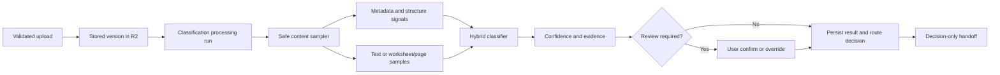

# Task 4 — Document Classification Engine

## 1. Current classification audit

The Task 3 upload path already supplied durable document/version records, R2 object storage, processing runs, history, audit events, authenticated project ownership checks, and document cards. Those components are reused.

The previous `inferDocumentRole` and `classifyDocument` helpers were presentation-era heuristics. They relied mainly on names and manually selected types, did not inspect stored bytes, did not persist evidence or alternatives, and could not safely route downstream work. They remain only where older demo views need them; the durable upload workflow now invokes the classifier in `worker/classification-api.mjs`.

Conflicts corrected by this task:

- The Task 3 category list remains an upload hint, while the canonical classification taxonomy is defined separately and versioned.
- User-selected types and filenames are weak supporting signals and cannot produce high confidence.
- Classification is immutable history: reruns supersede results instead of silently replacing them.
- Manual changes require a reason when replacing a high-confidence result and create audit records.
- Classification selects a downstream route but does not run extraction. Task 5 remains out of scope.

## 2. Target architecture

The engine is modular: sampling, scoring, taxonomy, persistence, API orchestration, and UI actions are separate. Adding a category means adding a taxonomy/profile entry rather than restructuring the application.

## 3. Classification taxonomy

The canonical taxonomy supports: BOQ, Technical Specification, Drawing, Product Catalogue, Product Datasheet, Price List, Supplier Quotation, Cost Sheet, RFQ, Tender Document, Compliance Document, Clarification, Approved Vendor List, Previous Project Reference, Project Email, Commercial Offer, Technical Offer, Contract, Other, and Unknown.

Each type has a downstream route. Routes are decisions only, such as `BOQ_REVIEW`, `SPECIFICATION_REVIEW`, `DRAWING_REVIEW`, `COMMERCIAL_REVIEW`, or `MANUAL_TRIAGE`; no extractor is invoked.

## 4. Classification rules and signals

The engine reads actual bytes and combines:

- content phrases and headings, including engineering clauses, commercial terms, RFQ language, item/quantity/unit patterns, model references, and contract wording;
- structure, including worksheet names, table-shaped rows, page boundaries, clause patterns, and PDF drawing dimensions;
- metadata, including MIME type, extension, filename, declared type, revision, and project name, at deliberately low weight;
- a statistical lexical-centroid similarity score, combined with deterministic domain profiles.

XLSX and DOCX are parsed from their OpenXML packages. CSV and EML are sampled as text. PDFs are inspected per page when literal text is available. ZIP archives are inspected through safe readable entries. Images and image-only PDFs are explicitly routed to OCR/manual review; legacy OLE files are routed to a converter/manual review instead of being guessed.

Mixed files retain a primary prediction plus page, worksheet, or section segment predictions and alternatives.

## 5. Hybrid/AI design

Versioned deterministic profiles and a statistical content model run locally and produce a reproducible baseline. A strict AI-result validator is included for later ambiguous-result escalation. An external model is not configured in this local build, so the product never implies that a remote model ran.

When an AI provider is added, it must receive bounded content/structure samples rather than whole documents, return only the canonical JSON contract, and pass taxonomy, score, evidence, and alternative validation before persistence. Provider/model and prompt versions belong in `classification_model_versions`; the current engine records classifier `hybrid-engine-1.0.0`, ruleset `construction-taxonomy-2026-08-01`, and prompt contract `classification-escalation-v1` for traceability.

Document content is not logged. Stored evidence is a bounded explanation of matched signals and sample locations.

## 6. Confidence model

Scores are derived from the separation and strength of the top content/structure profiles plus lexical similarity. Confidence is constrained by evidence quality:

- filename or preliminary type alone can never create high confidence;
- missing readable content forces review;
- conflicting or close alternatives reduce confidence;
- mixed documents are capped below automatic high-confidence routing;
- unreadable/encrypted/unsupported documents return actionable `Unknown`/review states;
- manual confirmation is recorded separately and never rewrites the original model confidence.

The UI uses High, Medium, Low, and Unclassified confidence states. Medium, Low, Unknown, mixed, OCR-required, and otherwise ambiguous results require review.

## 7. Database changes

Migration `drizzle/0002_serious_epoch.sql` adds:

- classification model versions;
- immutable document classification runs with confidence, review state, versions, supersession, and timestamps;
- ranked candidate predictions;
- structured evidence;
- page/sheet/section segments;
- manual confirmations and overrides;
- decision-only downstream routing handoffs.

Indexes cover current-result retrieval, document history, evidence, segments, overrides, and handoff status. Existing document and processing-job tables remain authoritative.

## 8. API changes

Authenticated, owner-scoped endpoints are available below `/api/documents/:documentId/classification`:

- `POST /start`
- `GET /status`
- `GET /result`
- `GET /evidence`
- `POST /confirm`
- `POST /override`
- `POST /rerun`
- `GET /history`
- `POST /page`
- `POST /sheet`

Start is idempotent when a current result exists. Rerun creates history. Page and worksheet actions allow partial mixed-document overrides. Errors include codes, user-facing messages, technical context, and suggested actions.

## 9. Queue integration

After R2 persistence and validation, the upload workflow schedules classification through the existing processing run and request `waitUntil` lifecycle. Progress moves through queued, processing, and completed/needs-review/failed states. Retry and cancel continue to use the Task 3 job controls. The implementation observes a bounded execution budget and preserves actionable failure state rather than marking placeholder success.

## 10. Frontend changes

Existing document cards now show predicted type, confidence percentage/state, processing/review status, selected route, and actionable errors. Users can inspect evidence, confirm a result, change the type with a reason, classify a page range or worksheet, and rerun classification. The existing page and upload experience were not redesigned.

## 11. Security and privacy

- Every endpoint requires the existing authenticated identity and project ownership check.
- Local fallback identity is allowed only on local hostnames.
- Bytes are read only from the document version's isolated R2 object key.
- Archive paths are validated before sampling.
- Full document text is not written to logs or classification evidence.
- Overrides and confirmations are audited with actor, old/new values, reason, and request ID.
- Unknown, unreadable, encrypted, and OCR-required inputs fail safely into review.

Malware scanning remains a deployment integration hook represented by the Task 3 quarantine state; a production scanner must clear it before trusted downstream extraction.

## 12. Test plan and results

Automated tests cover taxonomy completeness, route mapping, real BOQ CSV content, specifications, quotations, price lists, RFQs, compliance files, emails, literal-text PDF pages, XLSX worksheet segmentation, mixed documents, weak metadata safeguards, OCR/legacy review paths, AI response validation, queue integration, APIs, persistence, and decision-only routing.

Release checks run:

- classification tests;
- the complete repository test suite;
- ESLint;
- the verified production Sites build;
- fresh SQLite migration application and foreign-key integrity checks.

## 13. Implementation summary

Implemented files include:

- `app/domain/document-classifier.mjs` — taxonomy, content sampling, scoring, evidence, segments, confidence, and validation;
- `worker/classification-api.mjs` — queue execution, persistence, audit, routing decisions, and APIs;
- `worker/document-api.mjs` — automatic scheduling and classification summaries in document results;
- `worker/index.ts` — API dispatch;
- `db/schema.ts` and `drizzle/0002_serious_epoch.sql` — durable classification history;
- `app/page.tsx` and `app/globals.css` — status, evidence, review, and override controls;
- `tests/document-classifier.test.mjs` — Task 4 regression coverage.

## 14. Known limitations and next steps

- Scanned images and image-only PDFs require an OCR service; this build returns `OCR_REQUIRED` and review guidance instead of fabricating a type.
- Legacy XLS/DOC/MSG containers require a sandboxed converter/parser.
- Some compressed or encoded PDF text streams require a full PDF extraction service; literal-text pages are classified now and unsupported pages fail safely.
- Drawing symbol/image understanding, logo detection, and visual layout models are future classifier adapters.
- Project context is currently limited to fields already available from Task 3; discipline, system, supplier, and tender-package entities can be added later as low-weight context.
- External LLM escalation is deliberately disabled until a provider, privacy policy, cost controls, evaluation set, and monitoring are approved.
- Production malware scanning must replace the quarantine integration hook.

These limitations are visible review states, not silent or simulated success. Task 5 BOQ extraction has not been started.
