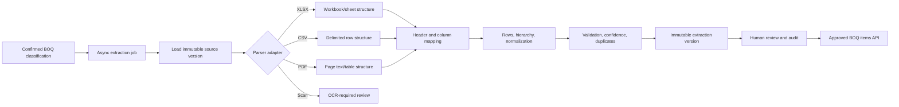

# Task 5 — Real BOQ Extraction Engine

## 1. Current BOQ extraction audit

The product already had a small native OpenXML reader, a strict CSV intake preview, document/version storage, classification, processing jobs, audit events, and a BOQ review visual language. These were reused.

The gaps were material: the UI contained a fingerprint-specific 21-line showcase derived from a known 90-row workbook, CSV was client-only and non-durable, blank quantities became zero, only one-row headers worked, PDFs were readiness-checked but not table-parsed, and there was no canonical extraction history, evidence, warnings, row editing, revision comparison, or approved-item API. Those paths are not the new authoritative extraction engine. Durable uploaded documents now use the versioned worker and database records described below.

## 2. Target architecture

Extraction is downstream of Task 4 and does not alter upload or classification. No specification extraction or pricing/matching engine is invoked.

## 3. File-type parser design

- XLSX: safe ZIP/OpenXML parsing; sheets are not assumed by position. Sheet name/state, hidden status, rows, cells, cached values, formulas, frozen panes, merged ranges, and cell references are retained. Macros are never executed.
- CSV: quoted cells are parsed into a source-row matrix; original strings and row numbers remain available.
- PDF: literal native text is separated by page and reconstructed into candidate columns from preserved spacing, tabs, or explicit delimiters. Page and row provenance remain attached.
- Scanned PDF: detected only when native text is absent and image objects exist. With no approved OCR provider configured locally, the job returns `OCR_REQUIRED`; it never invents rows.
- XLS: returns `LEGACY_WORKBOOK_CONVERTER_REQUIRED`. A sandboxed converter must be configured before legacy OLE content is readable.

Parser adapters share one normalized matrix contract so future formats can be added without changing persistence or review logic.

## 4. Header and column mapping rules

The engine recognizes all Task 5 aliases for item number, description, unit, quantity, part number, manufacturer, specification/drawing reference, notes, and section. It evaluates one-, two-, and three-row headers, rewards the three core BOQ columns, prevents one physical column from satisfying multiple semantic fields, and penalizes unnecessarily deep header spans.

An adjacent-column density check handles real workbooks where a `Description` label is above an item-code/description pair. This was discovered and corrected against the supplied fire-alarm `BOQ.xlsx`: the final mapping correctly selects column A as item code, B as description, C as unit, and D as quantity.

## 5. Row classification rules

Supported row types are BOQ Item, Section Header, Subsection Header, Subtotal, Grand Total, Note, Alternative Item, Optional Item, Provisional Sum, Allowance, Daywork, Rate-Only Item, Blank Separator, and Unknown.

Totals, notes, headings, and unknown rows cannot be approved for downstream matching. Classification uses mapped field presence plus explicit semantic phrases. Blank separators are not persisted as commercial items. Wrapped/continued material is only joined through explicit review actions; automatic ambiguous joins are avoided.

## 6. BOQ data model

Migration `drizzle/0003_pretty_iron_man.sql` adds eight canonical entities:

- extraction versions;
- extraction sources (sheet/page);
- sections;
- BOQ items;
- field evidence;
- warnings;
- review decisions;
- revision comparisons.

Every item stores the project/document/extraction version, sequence, hierarchy, engineering fields, original and normalized units/quantities, row type, confidence, review state, source location, original raw values, current editable values, and downstream approval flag. Reprocessing supersedes an extraction version rather than overwriting it.

## 7. Validation model

Validation warns on missing description/unit/quantity, unrecognized units, text/range/formula quantities that require interpretation, duplicate candidates, and uncertain rows. Blank quantities remain `null`, never zero. Formula text and cached values are stored independently. Generated or inferred values are marked by source type and cannot masquerade as source values.

## 8. Confidence model

Confidence combines header certainty, parser quality, unit/quantity certainty, field completeness, row structure, and validation results. High confidence is capped when warnings exist, duplicates are possible, source boundaries are ambiguous, or a row is not a BOQ Item. Human approval is a separate state and does not rewrite original extraction confidence.

## 9. API specification

Document-scoped endpoints:

- `POST /api/documents/:id/boq-extraction/start`
- `GET /status`, `/summary`, `/items`, `/evidence`, `/warnings`, `/history`
- `POST /rerun`, `/compare`
- `GET /export`, `/approved-items`

Item-scoped endpoints:

- `GET /api/boq-items/:id`
- `POST /update`, `/restore`, `/row-type`, `/merge`, `/split`, `/approve`, `/reject`
- `GET /evidence`, `/warnings`

Project ownership is checked on every operation. Lists are paginated; review-state filtering is supported. Start is idempotent when a current extraction exists. CSV exports neutralize formula-injection prefixes.

## 10. Queue and worker changes

A high-confidence BOQ classification automatically schedules extraction. Manual BOQ confirmation/override does the same. The worker records a real processing run and history, reads immutable R2 bytes, reports actual stages, enforces a bounded local execution budget, stores parser/rules/OCR versions, and retains actionable failure information. Rerun creates a new extraction version.

## 11. Frontend changes

The existing document register now shows extraction status/version, valid item count, review count, sections, average confidence, and actionable errors. A persistent review launcher opens the row review table with source sheet/page/row, original unit/quantity, confidence, warnings state, and actions for edit, restore, row type, merge, split, approve, and reject. Users can open the original source and export raw extraction. Unrelated screens were not redesigned.

## 12. Revision strategy

Re-extraction is append-only. Revision comparison keys rows by explicit item number when available, otherwise normalized description plus section. It reports added, removed, and changed rows, including description, quantity, unit, and item-number changes. Comparison records reference both extraction versions and never overwrite either dataset.

## 13. Security review

- Authenticated project ownership gates all document and item APIs.
- Original files remain in isolated R2 keys and are never executed.
- XLSX is parsed as data; uploaded macros are not run.
- ZIP path safety is inherited from Task 3 validation.
- Export values beginning with `=`, `+`, `-`, or `@` are apostrophe-prefixed.
- Full source text is not logged; bounded provenance/evidence is persisted.
- Manual changes retain original raw values and create both review-decision and document-audit records.
- OCR and legacy conversion fail closed until approved sandboxed providers exist.

## 14. Test plan and evidence

Automated coverage includes header mapping, units, numeric/decimal/formula/range/lump-sum/blank quantities, hierarchy, row types, hidden sheets, merged ranges, formulas, duplicates, CSV missing values, native-text PDF page provenance, scanned-PDF OCR routing, revision comparison, persistent API contracts, audit actions, approved downstream access, migrations, and Tasks 3-4 regressions.

The supplied `/Users/serein-b/Downloads/17- Fire Alarm/BOQ.xlsx` was also processed directly. The engine reviewed its `MECH RFQ` sheet, detected the real table, mapped A/B/C/D correctly, retained row anchors, detected 108 structured rows, and identified 90 BOQ item rows without using the old fingerprint-specific normalized output.

## 15. Implementation summary

- `app/domain/boq-extractor.mjs`: parser-neutral extraction, normalization, hierarchy, confidence, validation, duplicates, summary, and revision comparison.
- `app/document-parsers/xlsx.mjs`: formulas, hidden-sheet state, frozen panes, merges, and stronger provenance.
- `worker/boq-extraction-api.mjs`: queue execution, durable persistence, APIs, review actions, audit, revision comparison, and safe export.
- `worker/classification-api.mjs`: automatic extraction scheduling after eligible BOQ classification.
- `worker/document-api.mjs` and `worker/index.ts`: summaries and dispatch.
- `db/schema.ts` and `drizzle/0003_pretty_iron_man.sql`: canonical versioned storage.
- `app/page.tsx` and `app/globals.css`: extraction summary and manual review UI.
- `tests/boq-extractor.test.mjs`: Task 5 regression suite.

## 16. Known limitations

- No OCR provider is configured. Scanned PDFs are identified and fail safely with an actionable review state; OCR text/bounding boxes cannot be produced locally yet.
- Legacy XLS requires a sandboxed converter.
- The native PDF adapter handles literal text with recoverable spacing; compressed, rotated, multi-column, font-encoded, or irregular PDFs require a production layout parser/OCR provider.
- Cell comments, Excel outline groups, number formats, and evaluated formula dependency graphs are not yet decoded by the lightweight worker parser; cached formula value and formula text are retained.
- Automatic wrapped-row joining is intentionally conservative. Ambiguous merges use the audited review workflow.
- The older local showcase dataset is still present for backward-compatible product demonstrations, but it is not written to the new canonical extraction tables and is not returned by the approved-items API. Removing the showcase entirely is a separate product-data migration, not an extraction rule.

Task 6 specification extraction has not been started.
