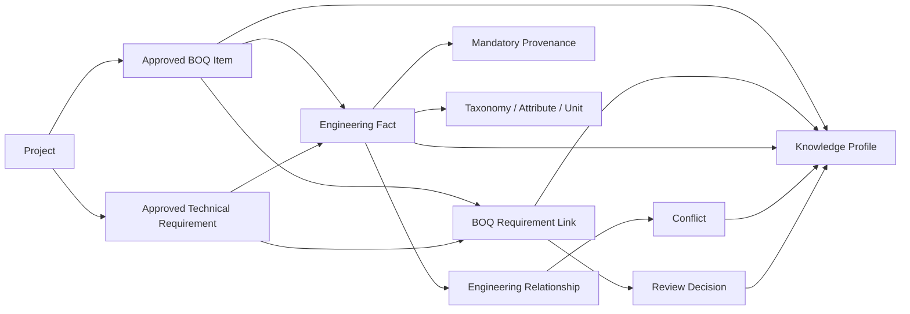

# Task 7 — Engineering Knowledge Model

## 1. Current data model audit

Tasks 3–6 already provided authoritative project, document/version, BOQ extraction, specification requirement, evidence, review and audit records. They were reused. The gaps were a canonical fact classification, mandatory cross-source provenance, controlled scope/version semantics, reusable taxonomy/units/standards, BOQ-to-requirement applicability links, general engineering relationships, project overrides, knowledge conflicts, decisions and a complete BOQ knowledge profile. Local showcase products and requirements remain non-authoritative.

## 2. Canonical entity model

Migration `drizzle/0005_gigantic_vector.sql` adds taxonomy terms, unit definitions, attribute definitions, standards bodies, standards and versions, engineering facts, fact provenance, BOQ-requirement links, engineering relationships, knowledge decisions and knowledge conflicts. Existing BOQ items and technical requirements remain their authoritative domain entities.

## 3. Entity relationship diagram

## 4. Engineering taxonomy

Taxonomy is data-driven and versioned by term type, canonical/display name, parent, code, synonyms, scope and effective dates. It supports Domain → System → Category → Subcategory → Equipment Type → Product Family without frontend hard-coding.

## 5. Fact classification model

Controlled fact types are Source Fact, Normalized Fact, Derived Fact, Inferred Fact, Assumption, Human Decision, AI Suggestion, Global Rule, Project Rule, Manufacturer Rule and Supplier Claim. Normalized facts require a source-fact link; derived/inferred facts require a derivation; AI suggestions cannot approve themselves.

## 6. Provenance model

Every source-backed fact retains source type/id, evidence/document/version/extraction identifiers, page range, sheet, section, clause, row, cell, bounding box where available, original text, extraction/parser/model/prompt/rule versions, confidence and creation time. Human records require user, role, reason and evidence.

## 7. Scope model

Supported scopes are Global, Organization, Business Unit, Engineering Domain, Manufacturer, Product Family, Product, Supplier, Project, Project Package, BOQ Item and Document Revision. Project rules cannot be written as global rules. Effective resolution places the narrowest applicable project/BOQ scope ahead of global facts without modifying the global record.

## 8. Versioning model

Facts, taxonomy terms, units, standards, relationships and links support versions, effective dates, previous/superseding identifiers and soft deletion where appropriate. Existing extraction versions remain immutable. Publication uses stable source-derived identifiers and `INSERT OR IGNORE`, making backfill idempotent.

## 9. Attribute and unit model

Attribute definitions include domain/category applicability, data type, unit family, allowed units/values, comparison method, normalization rules, synonyms and validation rules. Unit conversion retains original value/unit, checks family compatibility, fails closed on unknown units and supports voltage, current, power, apparent power, length, bandwidth, duration, percentage, sound, illuminance and resolution.

## 10. Compatibility model

`engineering_relationships` stores left/right typed entities, relationship type, conditions, exceptions, provenance fact, confidence, review state, scope, effective dates and reviewer. It supports compatible with, incompatible with, supports, interfaces with, powered by, licensed by and future controlled relationships without recommending products.

## 11. Accessory dependency model

The same relationship model supports Requires, Includes, Optional With, Replaces, Mounted With, Powered By, Licensed By, Connected To and Installed With plus quantity rules. Every relationship requires scope and source fact or approved human decision.

## 12. BOQ-to-requirement linking model

Link candidates use explicit specification references, system, category and shared technical terms. Generated links are always Suggested or Needs Review—even high-scoring links are never Confirmed automatically. Confirmation/rejection/removal requires a reviewer and reason and creates a reversible knowledge decision plus project audit event.

## 13. Database migration plan

The append-only migration preserves all Tasks 3–6 tables and identifiers. `publishApprovedEngineeringKnowledge` is the compatibility/backfill adapter: it reads only approved downstream BOQ items and approved technical requirements, creates stable facts and provenance, skips duplicates, and records a publication audit. The five prior migrations plus Task 7 apply cleanly to an empty SQLite test database: 52 tables and 133 indexes. Rollback is removal of the new read/write routes and Task 7 tables; source extraction data remains intact.

## 14. API specification

- `POST /api/projects/:id/engineering-knowledge/publish`
- `POST /api/projects/:id/engineering-knowledge/suggest-links`
- `GET /facts`, `/taxonomy`, `/units`, `/standards`, `/conflicts`
- `GET /api/boq-items/:id/knowledge-profile`
- `POST /api/requirement-links/:id/confirm`, `/reject`, `/remove`

Every route authenticates, checks project ownership, paginates lists where applicable, validates decisions and returns explicit errors.

## 15. Knowledge service design

`app/domain/engineering-knowledge.mjs` is the approved pure domain layer for fact/provenance validation, unit normalization, effective version and scope resolution, applicability scoring/review validation and knowledge-profile assembly. `worker/engineering-knowledge-api.mjs` owns persistence, publication, retrieval and audit. UI code does not construct canonical records directly.

## 16. Security review

Project ownership is checked before publication, profiles and link decisions. Only approved extraction records publish. Global modification is not exposed to the project API. AI suggestions remain non-approved. Manual decisions require identity/reason and are auditable. Historical source records are not deleted or overwritten. Product recommendation and pricing are outside this task.

## 17. Test plan and results

Focused tests cover fact/provenance rules, normalized lineage, AI safety, compatible/invalid unit conversion, effective version resolution, project override isolation, non-confirming applicability suggestions, required human review, Task 8 profile assembly and API/schema contracts. Task 7 focused tests pass 7/7. The complete suite passes 274/274 with zero failures; build and lint pass; all six migrations apply cleanly.

## 18. Implementation summary

- `app/domain/engineering-knowledge.mjs`: canonical rules and profile assembly.
- `worker/engineering-knowledge-api.mjs`: approved publication, suggestions, profiles, reviews and audit.
- `db/schema.ts` and `drizzle/0005_gigantic_vector.sql`: versioned knowledge persistence.
- `worker/index.ts`: knowledge API dispatch before framework routing.
- `app/page.tsx`: focused publish/suggest/review controls in the existing document workflow.
- `tests/engineering-knowledge.test.mjs`: Task 7 safety and contract coverage.

## 19. Known limitations

Task 7 defines product/manufacturer relationship targets but deliberately does not ingest product libraries, rank products, calculate prices or decide final compliance. Suggested-link scoring is deterministic and conservative; semantic/vector retrieval can be added later only as another explainable signal. Role headers provide authorization context but the local demo still lacks a full enterprise identity/role directory. Profile caching and bulk job partitioning are not yet necessary at local-demo scale.

Task 8 may consume only confirmed links and approved source-proven facts from this model.
